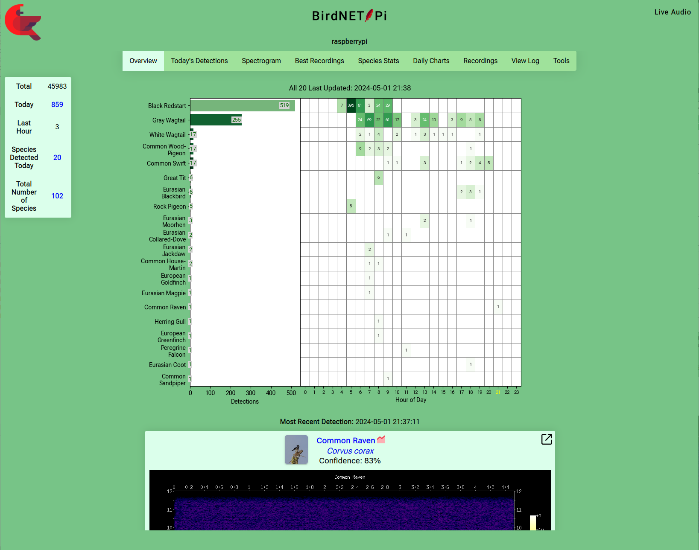

<h1 align="center"><a href="https://github.com/mcguirepr89/BirdNET-Pi/blob/main/LICENSE">Review the license!!</a></h1>
<h1 align="center">You may not use BirdNET-Pi to develop a commercial product!!!!</h1>
<h1 align="center">BirdNET-Pi</h1>
<p align="center">
A realtime acoustic bird classification system for the Raspberry Pi 5, 4B, 400, 3B+, and 0W2
</p>
<p align="center">
  
</p>
<p align="center">
Icon made by <a href="https://www.freepik.com" title="Freepik">Freepik</a> from <a href="https://www.flaticon.com/" title="Flaticon">www.flaticon.com</a>
</p>

## About this fork:

In 2024, [Nachtzuster](https://github.com/Nachtzuster/BirdNET-Pi) forked and began building on [mcguirepr89's](https://github.com/mcguirepr89/BirdNET-Pi) most excellent earlier work to further update and improve BirdNET-Pi. We hope you find it useful.

Changes include:
 - Raspberry Pi 5 support
 - Support for 'Species range model V2.4 - V2'
 - Bump tflite_runtime to 2.11.0, it is faster
 - Debian Bookworm support
 - Backup & Restore Tools
 - More responsive Web ui
 - Daily charts now include all species, not just top/bottom 10
 - Bump apprise version, so more notification type are possible
 - Swipe events on Daily Charts (by @croisez)
 - Experimental support for writing transient files to tmpfs
 - Rework analysis to consolidate analysis/server/extraction. Should make analysis more robust and slightly more efficient, especially on installations with a large number of recordings
 - Rework daily_plot.py (chart_viewer) to run as a daemon to avoid the very expensive startup
 - Lots of fixes & cleanups

!! note: see 'Migrating' on how to migrate from mcguirepr89

## Introduction
BirdNET-Pi is built on the [BirdNET framework](https://github.com/kahst/BirdNET-Analyzer) by [**@kahst**](https://github.com/kahst) <a href="https://creativecommons.org/licenses/by-nc-sa/4.0/"></a> using [pre-built TFLite binaries](https://github.com/PINTO0309/TensorflowLite-bin) by [**@PINTO0309**](https://github.com/PINTO0309) . It is able to recognize bird sounds from a microphone in near realtime and share its data with the rest of the world.

Check out birds from around the world
- [BirdWeather](https://app.birdweather.com)<br>

Since at least 2021, listening in countries all around the world:

Argentina, Australia, Austria, Belarus, Belgium, Brazil, Canada, Colombia, Costa Rica, Crete, Croatia, Czech Republic, Denmark, England, Estonia, Finland, France, Germany, Hungary, Ireland, Israel, Italy, Japan, Luxembourg, New Zealand, Norway, Oman, Romania, Russia, Rwanda, Scotland, South Africa, South Sudan, Spain, Sweden, Switzerland, Tasmania, Thailand, The Philippines, The United States

## Features
* **24/7 recording and automatic identification** of bird songs, chirps, and peeps using BirdNET machine learning
* **Automatic extraction and cataloguing** of bird clips from full-length recordings
* **Tools to visualize your recorded bird data** and analyze trends
* **Live audio stream and spectrogram**
* **Disk space management** to periodically delete/purge old audio files
* [BirdWeather](https://app.birdweather.com) API integration -- request a BirdWeather ID from BirdNET-Pi's "Tools" > "Settings" page
* Web HTTP interface access to data and logs provided by [Caddy](https://caddyserver.com)
* Web Terminal - [GoTTY](https://github.com/yudai/gotty)/[GoTTY x86](https://github.com/sorenisanerd/gotty)
* File Browsing - [Tiny File Manager](https://tinyfilemanager.github.io/)
* FTP server included
* Database Store - SQLite3
* Database Tool - [Adminer](https://www.adminer.org/)
* System Info using [phpSysInfo](https://github.com/phpsysinfo/phpsysinfo)
* [Apprise Notifications](https://github.com/caronc/apprise) supporting 90+ notification platforms
* International Localization supported

## Requirements
* Raspberry Pi:  5, 4B, 400, 3B+, 0W2 (3B+ and 0W2 must run on RaspiOS-ARM64-**Lite**)
* SD Card with the **_64-bit version of RaspiOS_** installed (please use Debian Bookworm) -- Lite is recommended, but the installation works on RaspiOS-ARM64-Full as well. Downloads available within the [Raspberry Pi Imager](https://www.raspberrypi.com/software/).
* A USB Microphone or Audio Interface and Microphone

## Installation
[A historical installation guide is available here](https://github.com/mcguirepr89/BirdNET-Pi/wiki/Installation-Guide). 
NOTE: This guide is slightly out-dated: make sure to pick Bookworm, also the curl command is still pointing to mcguirepr89's repo.

Please note that installing BirdNET-Pi on other server systems is not supported. If this is something that you require, please open a GitHub discussion for your idea and inquire about how to contribute to development.

[Raspberry Pi 3B[+] and 0W2 installation guide available here](https://github.com/mcguirepr89/BirdNET-Pi/wiki/RPi0W2-Installation-Guide)

The system can be installed with: (Note this points to Nachtzuster's fork)
```
curl -s https://raw.githubusercontent.com/Nachtzuster/BirdNET-Pi/main/newinstaller.sh | bash
```
The installer takes care of any and all necessary OS and BirdNet-Pi updates, so you can run that as the very first command upon the first boot, if you'd like.

The installation creates a log in `$HOME/installation-$(date "+%F").txt`.

## Access
The BirdNET-Pi can be accessed from any web browser using HTTP (Port 80) on the same network:
- http://birdnetpi.local OR your Pi's IP address
- Default Username: birdnet
- Default Password is empty. Change this in "Tools" > "Settings" > "Advanced Settings"


## Resources

Please take a look at the [wiki](https://github.com/mcguirepr89/BirdNET-Pi/wiki) and [discussions](https://github.com/mcguirepr89/BirdNET-Pi/discussions) for information on
- [BirdNET-Pi's Deep Convolutional Neural Network(s)](https://github.com/mcguirepr89/BirdNET-Pi/wiki/BirdNET-Pi:-some-theory-on-classification-&-some-practical-hints)
- [making your installation public](https://github.com/mcguirepr89/BirdNET-Pi/wiki/Sharing-Your-BirdNET-Pi)
- [backing up and restoring your database](https://github.com/mcguirepr89/BirdNET-Pi/wiki/Backup-and-Restore-the-Database)
- [adjusting your sound card settings](https://github.com/mcguirepr89/BirdNET-Pi/wiki/Adjusting-your-sound-card)
- [suggested USB microphones](https://github.com/mcguirepr89/BirdNET-Pi/discussions/39)
- [building your own microphone](https://github.com/DD4WH/SASS/wiki/Stereo--(Mono)-recording-low-noise-low-cost-system)
- [privacy concerns and options](https://github.com/mcguirepr89/BirdNET-Pi/discussions/166)
- [beta testing](https://github.com/mcguirepr89/BirdNET-Pi/discussions/11)
- [and more!](https://github.com/mcguirepr89/BirdNET-Pi/discussions)


## Updating 

Use the web interface and go to "Tools" > "System Controls" > "Update". If you encounter any issues with that, or suspect that the update did not work for some reason, please save its output and post it in an issue where we can help.

## Backup and Restore
Use the web interface and go to "Tools" > "System Controls" > "Backup" or "Restore". Backup/Restore is primary meant for migrating your data for one system to another. Since the time required to create or restore a backup depends on the size of the data set and the speed of the storage, this could take quite a while.

Alternatively, the backup script can be used directly. These examples assume the backup medium is mounted on `/mnt`

To backup:
```commandline
./scripts/backup_data.sh -a backup -f /mnt/birds/backup-2024-07-09.tar
```
To restore:
```commandline
./scripts/backup_data.sh -a restore -f /mnt/birds/backup-2024-07-09.tar
```

## x86_64 support 
**x86_64 is not supported.** Not officially anyway. It is mainly there for developers or otherwise more Linux savvy people.

That being said, some pointers:
- Use Debian 12
- The user needs passwordless sudo
- TFLite build needs AVX2 support. So Intel Haswell or newer, not sure what that means for AMD cpu's, let me know if you do.
- Some people get around the previous point by uninstalling `tflite_runtime` and replacing with `tensorflow` in the `./birdnet` venv. But beware: analysis will be slower, and the older v1 model won't work.

For Proxmox, a user has reported adding this in their `cpu-models.conf`, in order for the custom TFLite build to work.
```
cpu-model: BirdNet
    flags +sse4.1
    reported-model host
```

## Uninstalling
```
/usr/local/bin/uninstall.sh && cd ~ && rm -drf BirdNET-Pi
```

## Migrating
Before switching, make sure your installation is fully up-to-date. Also make sure to have a backup, that is also the only way to get back to the original BirdNET-Pi.
Please note that upgrading your underlying OS to Bookworm is not going to work. Please stick to Bullseye. If you do want Bookworm, you need to start from a fresh install and copy back your data. (remember the backup!)

Run these commands to migrate to this repo:
```
git remote remove origin
git remote add origin https://github.com/Nachtzuster/BirdNET-Pi.git
./scripts/update_birdnet.sh
```
## Troubleshooting and Ideas

*Hint: A lot of weird problems can be solved by simply restarting the core services. Do this from the web interface "Tools" > "Services" > "Restart Core Services"

Having trouble or have an idea? *Submit an issue for trouble* and a *discussion for ideas*. Please do *not* submit an issue as a discussion -- the issue tracker solicits information that is needed for anyone to help -- discussions are *not for issues*.

PLEASE search the repo for your issue before creating a new one. This repo has nothing to do with the validity of the detection results, so please do not start any issues around "False positives."

## Sharing
Please join a Discussion!! and please join [BirdWeather!!](https://app.birdweather.com)
I hope that if you find BirdNET-Pi has been worth your time, you will share your setup, results, customizations, etc. [HERE](https://github.com/mcguirepr89/BirdNET-Pi/discussions/69) and will consider [making your installation public](https://github.com/mcguirepr89/BirdNET-Pi/wiki/Sharing-Your-BirdNET-Pi).

## Homeassistant addon

BirdNET-Pi can also be added to [Homeassistant](https://www.home-assistant.io/) addon through docker.
For more information : https://github.com/alexbelgium/hassio-addons/blob/master/birdnet-pi/README.md

## Cool WriteUps and Extensions

- [Marie Lelouche's <i>Out of Spaces</i>](https://www.lestanneries.fr/exposition/marie-lelouche-out-of-spaces/) using BirdNET-Pi in post-sculpture VR! [Press Kit](https://github.com/mcguirepr89/BirdNET-Pi-assets/blob/main/dp_out_of_spaces_marie_lelouche_digital_05_01_22.pdf)
- [Research on noded BirdNET-Pi networks for farming](https://github.com/mcguirepr89/BirdNET-Pi-assets/blob/main/G23_Report_ModelBasedSysEngineering_FarmMarkBirdDetector_V1__Copy_.pdf)
- [PixCams Build Guide](https://pixcams.com/building-a-birdnet-pi-real-time-acoustic-bird-id-station/)
- <ins>[Core-Electronics](https://core-electronics.com.au/projects/bird-calls-raspberry-pi)</ins> Build Article
- [RaspberryPi.com Blog Post](https://www.raspberrypi.com/news/classify-birds-acoustically-with-birdnet-pi/)
- [MagPi Issue 119 Showcase Article](https://magpi.raspberrypi.com/issues/119/pdf)


### Internationalization:
The bird names are in English by default, but other localized versions are available thanks to the wonderful efforts of [@patlevin](https://github.com/patlevin). Use the web interface's "Tools" > "Settings" and select your "Database Language" to have the detections in your language.

## Screenshots



